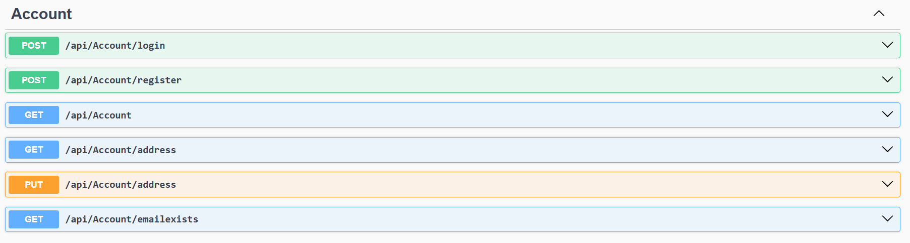
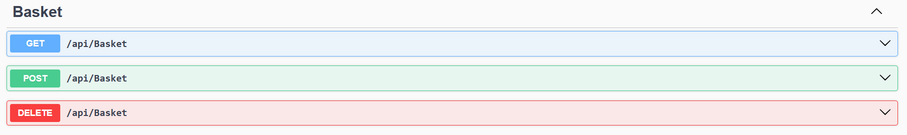
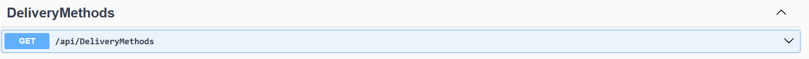
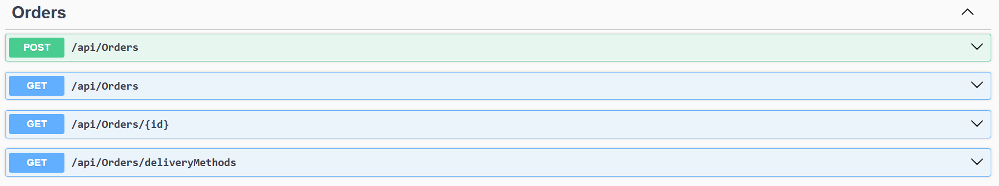
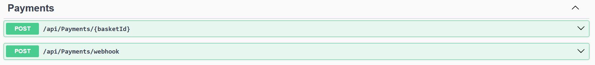
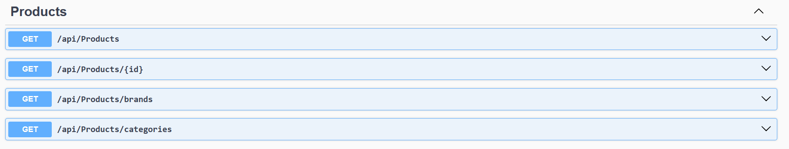

# 🛍️ E-Commerce Platform

A **full-stack e-commerce application** built with **ASP.NET Core Web API** and **Angular**, following **Clean Architecture** principles, It provides a complete shopping workflow — product browsing, cart management, secure checkout, and an admin panel for product and user management.

---

## 🏗️ Tech Stack

**Backend**
- ASP.NET Core 8 Web API (C#)
- Entity Framework Core + SQL Server
- ASP.NET Identity for user management
- AutoMapper
- Custom Logging Setup
- JWT Authentication + Role-based Authorization
- Clean Architecture & Repository Pattern
- Redis for basket (shopping cart) caching
- Stripe Payment Integration (Server-side)
- Data Seeding for products, users, and roles

**Frontend**
- Angular (TypeScript)
- Angular Material
- RxJS for state and async handling
- HTTP Interceptors for JWT
- Stripe Integration (Client-side)

---

## ✅ Core Features

- **Authentication & Authorization** using JWT (Admin / User roles)
- **Product Management** with pagination, filtering, and search
- **Checkout & Payments** integrated with Stripe
- **User & Role Management** (Admin dashboard)
- **Order Tracking** with secure endpoints
- **AutoMapper** for DTO mapping
- **Generic Repository + Unit of Work** for clean data access
- **Centralized Error Handling Middleware**
- **Database Seeding** for initial setup
- **Entity Auditing Interceptor** to automatically set:
  - `CreatedBy` / `CreatedOn`
  - `LastModifiedBy` / `LastModifiedOn`
- **Clean Architecture** for maintainability and scalability
- **FluentValidation** for request validation

---

## 🧠 Architecture Diagram

```text
/LinkDev.Talabat.APIs
├── Extensions
├── Middlewares
└── Program.cs

/LinkDev.Talabat.APIs.Controllers
├── Controllers
├── Errors
├── Mapping
└── Models

/LinkDev.Talabat.Core.Application
├── Exceptions
├── Extensions
├── Mapping
└── Services

/LinkDev.Talabat.Core.Application.Abstraction
├── Common
├── Models
└── Services

/LinkDev.Talabat.Core.Domain
├── Common
├── Contracts
├── Entities
└── Specifications

/LinkDev.Talabat.Infrastructure.Presistence
├── _Common
├── _Data
├── _Identity
├── GenericRepository
└── UnitOfWork

/LinkDev.Talabat.Infrastructure
├── BasketRepository
└── PaymentService

/LinkDev.Talabat.Shared
└── Models

---

## 📦 API Endpoints

**Account**


**Basket**


**Delivery Methods**


**Orders**


**Payments**


**Products**

